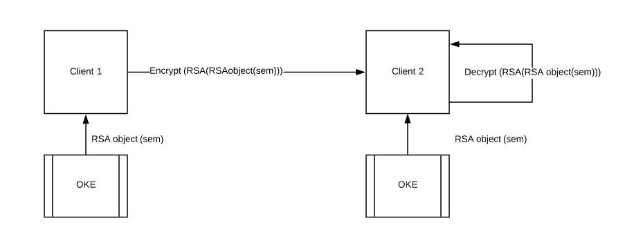

## One Key Execution (OKE)

This library project is the core of the new framework for secure communications of the new framework between services.

Allow operations:
- encrypt data 
- decrypt data 

Use RSA algorithm
Use custom RSA Object for make operations.

The principal skill of OKE is that for each encryption use anew RSA object with a different keyPair(public, private)
If the both encryptor client and decryptor client share the sem,they will create the same RSA object using One Key Executor class
  

#RSA Object Example:

======================RSA DATA =========================
	 mudulus = 1478583952996885926652396722987880784666381938469038159866117122976619308510932693970177828827544999939273038889068467876737053808716229809660868899030928300160609552213539576325092546422527391070618811263580930859892357456613088137600825227422497044526794560490459473360662703341841449614638895813188111
	 publicKey = 65537
	 privateKey = 977096791436015267671523714480097180266358474955453769102059393609631286636556205550367450275297105488044555613571971180762089558595773331501328580010178046952864964882353266964672130419424410251899916919139184070689436222758280203517390004580498607855295194976609034067927733976064945480473807633386473
	 p = 29954012034779222124380940409527641152211919222968886252275964355271025989175207857682466081647120975343495435568788207381754327023061861297395489171651
	 q = 49361800058039668207869954317103814559561735182933856475605726986125158580933186550753448953306058234485048910855351487997061102620730639258701578507461
	 mudulus = 1478583952996885926652396722987880784666381938469038159866117122976619308510932693970177828827544999939273038889068467876737053808716229809660868899030848984348516733323207325430365914966815617416212908520853049168550961272042979743192389312387543865316966016144035333665283887912197657114082798745509000
	 phi = 1478583952996885926652396722987880784666381938469038159866117122976619308510932693970177828827544999939273038889068467876737053808716229809660868899030848984348516733323207325430365914966815617416212908520853049168550961272042979743192389312387543865316966016144035333665283887912197657114082798745509000
======================RSA DATA =========================

#Execution loop example:

Main process test
	 
======================RSA DATA =========================
	 mudulus = 9199509249983381329123033750734775285446374186038360474180730614875093821280722254397417429783575514080471692701854871466698078560947742601916113168773698900376354911730036223812916049613083017855269991926658304488914078696510980680792043297688360055370310507142476787719478526964176678321632405208461
	 publicKey = 65537
	 privateKey = 7823309718621905055404031921352842378866636747340829520843411498219839234957939689096712782308131500163982618205784176136434136631785106709684464275675201808425409570753044326985155677411708492769991702456691863373055040314247539862249261361511789448170051241465154646619439303998696955634802055421473
	 p = 3245621880971741537723227850025122314825161316397056041278609924161734822357234137253601827948410355332383016450992341898499436975410216130670282532201
	 q = 2834436538623852760230279123206222894562747883911849923665545857883735023475673948267599386066037564234711295404996367384537598122859326715785435504261
	 mudulus = 9199509249983381329123033750734775285446374186038360474180730614875093821280722254397417429783575514080471692701854871466698078560947742601916113168767618841956759317432082716839684704403695108654961085961714148706868608850678072595270842083673912135803216195286488078436441491865907135475176687172000
	 phi = 9199509249983381329123033750734775285446374186038360474180730614875093821280722254397417429783575514080471692701854871466698078560947742601916113168767618841956759317432082716839684704403695108654961085961714148706868608850678072595270842083673912135803216195286488078436441491865907135475176687172000
======================RSA DATA =========================
	 plaintext =  data to encrypt!! f0ns1  it= 0
	 encrypted data MTEwMzk3NjA0ODk1MTY3NTY3NDYxMTU2MjA5MDcxNDI3NjA1NzcxOTY4NDcyODg4ODA2MTQ5NTk4MzAwNDY4ODUxMjI0MzE2NDgyODk4NjY1MDQ0MzgzMjA2OTQwMjE3MDQ4MjU5MTIxMzUxOTcwMDM0NjI5NzkzOTgyNDc1MjM5MzkyMDYzOTUwMjQ0Njc1NjYyMDcyNTA3Njk0NDk1NjU4MTIxMjUxMjk5MjQ1Mzc0Nzc0MzM5NTM5ODEwNjU5NjIwMjU3NjQwMDgzODMxMzI1MjM0MjY2Mjc2MDE0MDkxNzM0MTc0NDIyODM4MjI4Mzg2MTYzMjI1NTI4MjA0NTYxMjQyMjQyMTg4Njk0NDA3NjQwMDYwMDU4NDg4NjQ4MjMxOTc0ODY2NzYyNA==
	 decrypted data data to encrypt!! f0ns1  it= 0
	 
======================RSA DATA =========================
	 mudulus = 14845168333393292153848817431870536283981934598495083680065699792211796045826284216992920195111615226913267684909332819547586299039255102486773609344776772196589801070089743524722184595249186531300570469613356534386821148252621341796813845608575373956784765008740860647892915835739374026164482825264877
	 publicKey = 65537
	 privateKey = 14537559828323665977110079099745474284292484864989486480963982894614658260602180367767652245328110130888911710175871202919641440499875691937358186583730304539603752455650562588252700344091745706061439126328052669403909336227522776011706533125726187607696587839986120752693009737870459347101440707252085
	 p = 3622817185957037170410236352065026424222198196901762127646839827214893916265230197034402533652709780196229949203047153199763836544298296304691746960763
	 q = 4097686295333076282880237585326685627333669831437354205640079970347989664996941599012664822523637123415203015268342238219199784439216426489730472324279
	 mudulus = 14845168333393292153848817431870536283981934598495083680065699792211796045826284216992920195111615226913267684909332819547586299039255102486773609344769051693108510956636453050784792883197630663272231353280069614589258264671359170000766778252399027053173332044269471256473952214755859303370060605979836
	 phi = 14845168333393292153848817431870536283981934598495083680065699792211796045826284216992920195111615226913267684909332819547586299039255102486773609344769051693108510956636453050784792883197630663272231353280069614589258264671359170000766778252399027053173332044269471256473952214755859303370060605979836
======================RSA DATA =========================
	 plaintext =  data to encrypt!! f0ns1  it= 0 it= 1
	 encrypted data MTAwMzA4MTIxMjI3NTAzODI1MTA1NDAzOTA0MTgzMjY1OTM1MzUwMTM2NzkzNDQwMTUwMTkzMzI2NTYwMTEzNjExOTc1ODU2MTYyNTM1MjI1MjYxMDAwMTE1Nzc3OTcxNjc0MDg4ODU2OTA5MDYxMTI4OTYwNzQ5OTkxNjU0NzM4OTU3NzQ5MTk4Mzk3OTgwNzc1MDAyMzI2NTAzMzU4NDYyNTQxMDU3NDU2MzQ2OTY3NjcwMjA4MzY0MTk0NTYzNjkwNDUxNzEwMzgwMzY2MDU4MzI5Mzk1MTk3MDkyMjM0MjgxNTY3NTU3MTEzOTc3NDgyMTY5MjkxNDcyMTQzODExODI1MTY5NzAxNDE3NDk3ODg1MDE5MDcyNzY0Mzg2ODI2NjU5NjU5OTY3MjU=
	 decrypted data data to encrypt!! f0ns1  it= 0 it= 1
	 
======================RSA DATA =========================
	 mudulus = 78296521962610480202352427465085114691679540297303030767776003884368271496408350977389928275539335095935518657950972605048641684771371178082609902915642935439360729073772521659154458376677496985637584698709953602834859468643304102376995263694813341085414734386159639804738694663822142428682212490881431
	 publicKey = 65537
	 privateKey = 58468220773763780781896147216706067000485171767856482990905253980209396326261877974784672624698949594810325207441912191450333766463385651698474581514117195002288030017961670701496151605809753927205083329243905423040863551958874029786603046425343656207944819913120535059116245099925823300047995370067713
	 p = 8536770428740928243944343232449708875934605555036717596809699534256154776350394686981039079165002947459167156855757786404882981873782956456906699895777
	 q = 9171679456086566305977954173882640217707800449537230221075458065027616998773746714848637088518236035379358348098722513444123183504577665620371737693303
	 mudulus = 78296521962610480202352427465085114691679540297303030767776003884368271496408350977389928275539335095935518657950972605048641684771371178082609902915625226989475901579222599361748126027583854579633010750892068445235575696868179960975165587527130102102576208881205159504889688498443781806604934053292352
	 phi = 78296521962610480202352427465085114691679540297303030767776003884368271496408350977389928275539335095935518657950972605048641684771371178082609902915625226989475901579222599361748126027583854579633010750892068445235575696868179960975165587527130102102576208881205159504889688498443781806604934053292352
======================RSA DATA =========================
	 plaintext =  data to encrypt!! f0ns1  it= 0 it= 1 it= 2
	 encrypted data Mjc0MTExMDEwNjAzNDcwNjg2Nzk0NjIxNTg0MzU4OTQyNTIyMTQ4NDE1OTk4OTM0MTM3OTcxMjI4MjQ5NzQ1MjExNTI0MzUxMzI3NTc4NjIzOTc2MTcwMzcyOTkyNzcwNzE4Mzc2OTcxNzE5ODM0NTg0MzcyNTk3MzE4MDQ1ODY1NzQwODIxMzcxNzUwMjc4MDg2MzQzNTc1NDc2OTMzNDUzMDE0Mjc1ODgyMjI0NDc4NDg0MzQ1NDc1Nzk4MDc0OTA2NTkwMTY0NDk5Mjg5MTY4NTgzNTEzNjIzMDczNTY1ODI5OTI2MDI2ODA3MTY1OTgyMjk0MjMyNjY3MTEyNjIwODAyMTk2MjA3Mzg3NTUyMTI1NzY0NDYyMjQ4Njc2MzQ1MDY0OTI3ODg2ODQ=
	 decrypted data data to encrypt!! f0ns1  it= 0 it= 1 it= 2
	 
======================RSA DATA =========================
	 mudulus = 461939115660508561763743962640965242234154745770399681644513332089724478288495440150193866324437537454085348891640114704662864308785703315655330731673251196960027658434024689957906248369956803169248176566022273787704330147948388819747624295928606767729055111746487183384135180663193710167171198445365031
	 publicKey = 65537
	 privateKey = 99038810353629336120700770848043130119354079875793611651236047258689269335362458299134443378925978283524623300981663056215846108347161409406488733245956437837098050838287311218553395795401480178154599913901504467326028891958519474039079675721927310402897492529147749485442915792861180907980814238062273
	 p = 23068399770732480260058367981625310390025734451763255862683820059595622734781674112275680865326770245561741721244869168923520969949525518144940875654241
	 q = 20024757688072648744667506917442058696604035343134927314034613922867363283104635486664200588299558947112118307730673902958270445735593576053613436205191
	 mudulus = 461939115660508561763743962640965242234154745770399681644513332089724478288495440150193866324437537454085348891640114704662864308785703315655330731673208103802568853305019964083007181000870173399453278382845555353721867161930502510148684414474980438536381251717511640312253389247508591072972644133505600
	 phi = 461939115660508561763743962640965242234154745770399681644513332089724478288495440150193866324437537454085348891640114704662864308785703315655330731673208103802568853305019964083007181000870173399453278382845555353721867161930502510148684414474980438536381251717511640312253389247508591072972644133505600
======================RSA DATA =========================
	 plaintext =  data to encrypt!! f0ns1  it= 0 it= 1 it= 2 it= 3
	 encrypted data MjkyMjY1MDY4Mjg4ODMxMjM0MjU0ODIzMjc2NDk4MDIzNzQ3NTI1NTE5NjUwODI1NTc5ODg2NDM5MzAxMDMyNDg2MjkxNjc3MTY2MzE1NTkxMDUwNzcyMzEwODE4OTQ5NDYzODMwMTM3MzczNjAzNjc1OTI2NDYyNTkxMzAyNzg0MjA4MjE0MzUwMzk2OTAwODYwMDA2MjY0ODk0ODg2MjQ1NzA5NDUwODMzNzk4NDQ3NTY0NjMwOTMyMzMwMTA2NDcyMzMyMDMxNTI5NDYwNDY0NTc3NDUyMzcyOTAwOTU0MTI4ODQ5NDY1ODg1MjU2ODg5MDc2MjQxMjM0NTU2MDI0OTczNTYzNTk3MjUyMzMzNDc1OTcxNzc0MjYxMzIzNDkwMjY0ODU2OTE0MzAx
	 decrypted data data to encrypt!! f0ns1  it= 0 it= 1 it= 2 it= 3
	 
======================RSA DATA =========================
	 mudulus = 1478583952996885926652396722987880784666381938469038159866117122976619308510932693970177828827544999939273038889068467876737053808716229809660868899030928300160609552213539576325092546422527391070618811263580930859892357456613088137600825227422497044526794560490459473360662703341841449614638895813188111
	 publicKey = 65537
	 privateKey = 977096791436015267671523714480097180266358474955453769102059393609631286636556205550367450275297105488044555613571971180762089558595773331501328580010178046952864964882353266964672130419424410251899916919139184070689436222758280203517390004580498607855295194976609034067927733976064945480473807633386473
	 p = 29954012034779222124380940409527641152211919222968886252275964355271025989175207857682466081647120975343495435568788207381754327023061861297395489171651
	 q = 49361800058039668207869954317103814559561735182933856475605726986125158580933186550753448953306058234485048910855351487997061102620730639258701578507461
	 mudulus = 1478583952996885926652396722987880784666381938469038159866117122976619308510932693970177828827544999939273038889068467876737053808716229809660868899030848984348516733323207325430365914966815617416212908520853049168550961272042979743192389312387543865316966016144035333665283887912197657114082798745509000
	 phi = 1478583952996885926652396722987880784666381938469038159866117122976619308510932693970177828827544999939273038889068467876737053808716229809660868899030848984348516733323207325430365914966815617416212908520853049168550961272042979743192389312387543865316966016144035333665283887912197657114082798745509000
======================RSA DATA =========================
	 plaintext =  data to encrypt!! f0ns1  it= 0 it= 1 it= 2 it= 3 it= 4
	 encrypted data MTMyMzMzNTM4OTk0NDk0NzE2MDkxNjk2MTI5NzU1NjM1MDk3MjgyNDY4NjE4OTQ0NjIzNjc3NzEyNTQzODI1MzA3MDk2NTM2ODQyNTkzNjA3NjYyNDIzNjk1NDUzMzczNTc4NTY4Nzc1OTkyMzA3MDAxMDM1MzA0MzMwNjMxNTg2MTg3Mzg5NDM0MDMwMjcwMDc5NzAzMTczNDg1OTE1NDEyMzQwNTY2OTg1NTE0MTM1MTQwNjMwMDM4NjEyODQxNzc1NTg5NTg1MzA0NTE3Mjc0MTgwNzQ3OTY1NDg1NjEzNTk2ODMyNjQ2MTQ5MTM3ODkxMDc4NzY5ODAwNzUwODI1MTI4ODE2NDM4NDQzOTc2OTcxMDcyODQzNzUyNDExNzYwMjAwNjYzMTAxMzc3Nw==
	 decrypted data data to encrypt!! f0ns1  it= 0 it= 1 it= 2 it= 3 it= 4
End process test

 